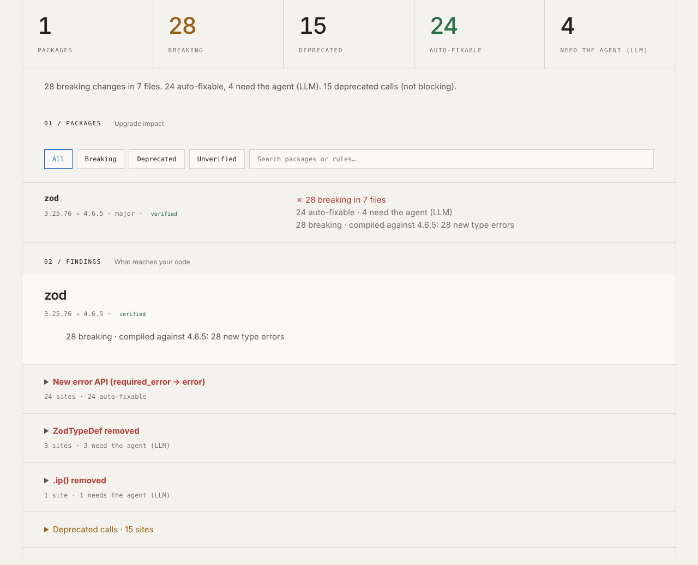

# Uptide

**Migrations you can merge.**

Uptide finds what a dependency upgrade breaks in your code, migrates it, and proves it with
your compiler and tests.

[](https://www.npmjs.com/package/uptide)
[](https://github.com/uptide-dev/uptide/actions/workflows/ci.yml)
[](LICENSE)



## Quickstart

No account, no config. Node 20 or newer. `check` works on npm, pnpm, Yarn and bun (text
lockfile); `fix` on npm, pnpm and Yarn with the node-modules linker. In your repository:

```sh
npx uptide list                            # fast discovery; no install or compilation
npx uptide check zod                       # analyze one or more named dependencies (install first)
npx uptide fix zod                         # migrate on a new branch, verified; nothing is pushed
npx uptide pr --branch uptide/zod-4.6.5    # prints the plan; add --yes to push and open the PR
```

`npx uptide` with no command shows where zod and stripe stand: installed, latest, majors
behind. Everything else: [getting started](docs/getting-started.md).

## Why Uptide

- Renovate and Dependabot bump the version. Uptide says what the bump breaks in your code,
  fixes it on a branch, and verifies the result with your compiler and your tests.
- Breaking means compiler-confirmed: a finding counts only when your code fails to compile
  against the target at that site, the runtime probe saw the export go, or a migration pack
  found it. Everything else is listed as possible impact, never counted.
- A migration is a pull request you can read: rule-based edits first, assisted edits only
  where a rule cannot, each kept only if its compiler error disappears and no new one
  appears, and a report that says what was verified and what was not.
- Runs locally, no account. Code leaves your machine only for assisted fixes, with your own
  API key, and `--no-llm` turns that off.

## Verified packs

A pack is everything Uptide knows about one upgrade: rules, a guide for the agent, behavior
checks, and ground truth from public repositories it is scored against. Precision and recall
are for breaking findings on that ground truth, as recorded by `uptide pack test`; a pack is
verified with two or more public repositories and no false positive. The contract:
[migration packs](docs/packs.md).

<!-- packs:start -->
| Package | Range | Precision | Recall | Ground-truth repositories | Status |
| --- | --- | ---: | ---: | --- | --- |
| `ai` | 6.x → 7.x | 100% | 36% | vercel/chatbot, miurla/morphic | verified |
| `stripe` | 14 and newer | 100% | 90% | unkeyed/unkey, nextjs/saas-starter | verified |
| `zod` | 3.x → 4.x | 100% | 71% | ugurkocde/AwesomeIntune, howardyang2009/PATH, band-ai/band-sdk-typescript | verified |
<!-- packs:end -->

Any other dependency gets the same analysis without a pack, and `fix` migrates it with the
agent alone ([concepts](docs/concepts.md)).

## Before and after

[`fixtures/repos/storefront`](fixtures/repos/storefront) is a small pnpm workspace in this
repository, written to exercise Uptide: two packages on zod 3 and stripe 14, with a few
tests. Everything below is real output from it.

**Before: `check`.** What breaks, where, and who can fix it:

```console
$ npx uptide check zod
uptide check · storefront · pnpm · 26s

zod            3.25.76 → 4.6.5   major · latest on npm   verified   ✗ 28 breaking in 7 files   24 auto-fixable · 4 need the agent (LLM)

zod   28 breaking · compiled against 4.6.5: 28 new type errors
  compiled 8 of 8 files in 2 workspaces with the repo's TypeScript 5.9.3
  ✗ New error API (required_error → error)   24 sites          auto-fixable
  ✗ ZodTypeDef removed                       1 fix, 3 errors   needs the agent (LLM)
  ✗ .ip() removed                            monitoring.ts:6   needs the agent (LLM)
  ! 15 deprecated calls (.uuid, .datetime, .email, ...)   8 auto-fixable

Next
  npx uptide fix zod                migrate on a new branch, verify, no push
  npx uptide check zod --details    every site and reason
```

**After: `fix`**, on its own verified branch:

```console
$ npx uptide fix zod
uptide fix · zod 3.25.76 → 4.6.5 (latest on npm) · verification passed · 36s

  Risk      Medium: request validation in webhooks
  Changes   29 sites in 8 files · 25 auto-fixed · 4 fixed by the agent (LLM)
  Types     ✅ 29 errors after the bump → 1 (1 pre-existing)
  Behavior  ✅ 9 schemas identical · 2 not checked · 21/21 custom-message assertions
  Tests     ✅ 5 tests in 3 files passed
```

No compiler sees this one: zod 4 words its default messages differently, and a test that
asserted the old wording failed after the migration. Uptide updated it and says so in the
pull request, so you can check that nothing else reads that text:

```diff
-    expect(parsed.error?.issues[0]?.message).toBe('Required');
+    expect(parsed.error?.issues[0]?.message).toBe('Invalid input: expected string, received undefined');
```

The stripe run from the same fixture, and what each step of `fix` does, are in
[`uptide fix`](docs/commands/fix.md).

## Privacy

Analysis runs locally, with no account and no Uptide server. Code leaves your machine only
for assisted fixes in `uptide fix`, with your own API key, one site at a time; `--no-llm`
turns that off. `check` loads your installed `typescript` to compile with and runs none of
your scripts. Anonymous telemetry is off by default and collects no IP, code, paths or repo names.

| | Where it runs | What leaves your machine |
| --- | --- | --- |
| `list`, `plan` | locally | package names/versions requested from your npm registry, and `list` sends public packages' names and installed versions to npm's advisory endpoint; metadata only, no source code |
| `check` | locally | nothing of yours; it downloads package tarballs from your npm registry. No LLM call. It loads your installed `typescript` package to compile with, and runs no script or other code of yours. |
| `fix`, rules and verification | locally, in a temporary clone | nothing of yours |
| `fix`, assisted fixes | Your chosen provider's API, with **your** environment API key | per site no rule covers: the finding, the enclosing function or declaration, and the compiler error |
| `pr`, `fix --pr` | GitHub, through your own `gh` | the branch and the pull request, when you say so |

The full statement and the isolation model: [privacy](docs/privacy.md) and [SECURITY.md](SECURITY.md).

## Documentation

- [Getting started](docs/getting-started.md), [concepts](docs/concepts.md) and
  [troubleshooting](docs/troubleshooting.md)
- Commands: [`list`](docs/commands/list.md), [`check`](docs/commands/check.md),
  [`plan`](docs/commands/plan.md), [`fix`](docs/commands/fix.md), [`pr`](docs/commands/pr.md),
  [`telemetry`](docs/commands/telemetry.md)
- [Models](docs/models.md), [CI with the GitHub Action](docs/ci.md), [FAQ](docs/faq.md)
- [Architecture](docs/architecture.md), [decisions](docs/decisions/) and the rest of the
  [documentation index](docs/README.md)

## Contributing

Setup, the rules that do not bend, how to write a migration pack and how to sign off:
[CONTRIBUTING.md](CONTRIBUTING.md). Security problems go through [SECURITY.md](SECURITY.md).

## License

[Apache-2.0](LICENSE). Releases up to and including 0.3.0 were published under the MIT
license; 0.4.0 and later are Apache-2.0.
